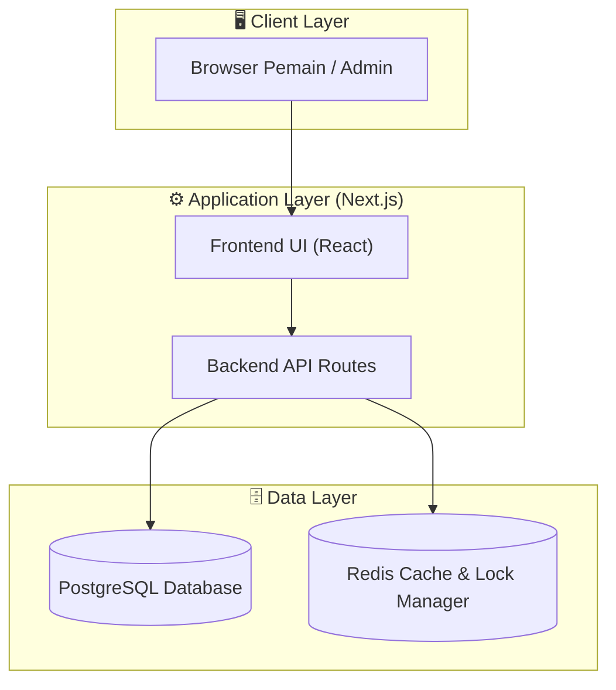
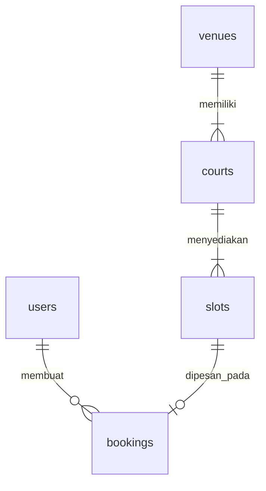

# PRD — PadelBook

## 1. Overview
* **Nama Produk:** PadelBook
* **Problem:** Proses booking lapangan padel via WhatsApp lambat karena pemain harus menunggu admin merespons secara manual hanya untuk mengecek ketersediaan jadwal.
* **Solusi:** Marketplace pemesanan lapangan padel real-time yang menyajikan jadwal kosong secara langsung dan memfasilitasi pembayaran transfer manual terverifikasi.
* **Target Pengguna:** Pemain Padel (pemesan) dan Pengelola Venue Padel (mitra admin).
* **Tujuan Utama:** Mengeliminasi waktu tunggu cek ketersediaan lapangan dan mendigitalisasi pencatatan jadwal bagi admin venue.
* **Metrik Keberhasilan:** Waktu booking dari pencarian hingga selesai < 3 menit, tingkat akurasi jadwal 100% (zero double-booking).

## 2. Requirements

### Functional Requirements
* [FR-01] Pemain dapat melihat daftar venue dan ketersediaan slot waktu (jadwal) secara real-time tanpa perlu login.
* [FR-02] Pemain dapat melakukan reservasi slot waktu kosong dengan memasukkan nama, nomor WhatsApp, dan mengunggah foto bukti transfer bank.
* [FR-03] Pengelola Venue dapat melihat daftar reservasi masuk dan mengubah status pembayaran (Setuju / Tolak) berdasarkan verifikasi manual.
* [FR-04] Sistem harus otomatis memperbarui status slot waktu menjadi "Terisi" setelah admin menyetujui pembayaran.

### Non-Functional Requirements
* [NFR-01] Sistem harus menerapkan mekanisme penguncian slot (temporary lock) selama 10 menit saat pemain berada di halaman pembayaran untuk mencegah double-booking.
* [NFR-02] Halaman jadwal ketersediaan lapangan harus dimuat dalam waktu kurang dari 1.5 detik pada koneksi internet seluler standar (p95).

## 3. Core Features

### Phase 1 (MVP)
* **Katalog & Grid Jadwal Real-time** — Menampilkan daftar venue, detail lapangan, dan status ketersediaan slot waktu per jam secara transparan.
* **Formulir Booking & Upload Bukti** — Alur checkout sederhana untuk mengisi data pemesan dan mengunggah gambar bukti transfer bank manual.
* **Dashboard Admin Venue** — Panel verifikasi bagi pengelola venue untuk menyetujui/menolak booking berdasarkan bukti transfer yang diunggah.

### Phase 2
* **Integrasi Payment Gateway** — Otomatisasi verifikasi pembayaran dengan Midtrans/Xendit untuk menghilangkan proses cek manual oleh admin (Dependensi: Phase 1 Formulir Booking).
* **Notifikasi WhatsApp Otomatis** — Pengiriman status booking langsung ke nomor WhatsApp pemain menggunakan WhatsApp Business API (Dependensi: Phase 1 Dashboard Admin).

## 4. User Flows

**Flow 1: Pencarian & Booking Lapangan (Pemain)**
1. Pemain membuka aplikasi → sistem menampilkan daftar venue padel yang tersedia.
2. Pemain memilih salah satu venue → sistem menampilkan grid slot waktu kosong untuk hari yang dipilih.
3. Pemain memilih slot waktu → sistem mengunci slot tersebut selama 10 menit dan menampilkan form data diri serta instruksi transfer bank.
4. Pemain mengisi data diri dan mengunggah foto bukti transfer → sistem menyimpan data booking dengan status "Menunggu Verifikasi" dan membebaskan kunci slot sementara (memasukkannya ke antrean verifikasi admin).

**Flow 2: Verifikasi Pembayaran (Admin Venue)**
1. Admin masuk ke dashboard → sistem menampilkan daftar booking masuk berstatus "Menunggu Verifikasi".
2. Admin memilih satu booking → sistem menampilkan detail pesanan beserta foto bukti transfer.
3. Admin menekan tombol "Setujui" → sistem mengubah status booking menjadi "Berhasil", memperbarui status slot waktu menjadi "Terisi" secara permanen, dan mengirimkan email/notifikasi konfirmasi.

## 5. Architecture

Berikut adalah gambaran arsitektur sistem PadelBook yang dirancang untuk kecepatan development dan konsistensi status ketersediaan lapangan.

### Pendekatan Arsitektur
Sistem menggunakan pola Monolith Modular dengan Next.js. Seluruh logika bisnis, API routing, dan rendering antarmuka disatukan dalam satu codebase untuk meminimalkan latensi jaringan dan mempercepat deployment MVP. Database PostgreSQL digunakan untuk menjamin konsistensi data transaksi (ACID) guna menghindari tumpang tindih jadwal (double-booking).

### Diagram Arsitektur

## 6. Database Schema

5 tabel utama yang diperlukan untuk MVP:

#### users
Menyimpan data pengguna (pemain terdaftar dan admin venue).
* `id` (UUID, PK) — ID unik user
* `name` (string) — Nama lengkap
* `phone` (string) — Nomor WhatsApp untuk kontak
* `role` (enum: player, admin) — Peran pengguna
* `created_at` (datetime) — Waktu pendaftaran

#### venues
Menyimpan informasi detail venue padel.
* `id` (UUID, PK) — ID unik venue
* `name` (string) — Nama venue
* `address` (text) — Alamat lengkap venue
* `created_at` (datetime) — Waktu penambahan venue

#### courts
Menyimpan data lapangan spesifik di dalam suatu venue.
* `id` (UUID, PK) — ID unik lapangan
* `venue_id` (UUID, FK → venues) — Relasi ke venue pemilik
* `name` (string) — Nama/Nomor lapangan (misal: "Lapangan A")
* `created_at` (datetime) — Waktu penambahan lapangan

#### slots
Menyimpan jadwal slot waktu operasional per lapangan.
* `id` (UUID, PK) — ID unik slot
* `court_id` (UUID, FK → courts) — Relasi ke lapangan
* `start_time` (datetime) — Waktu mulai slot
* `end_time` (datetime) — Waktu selesai slot
* `price` (decimal) — Harga sewa pada slot tersebut

#### bookings
Menyimpan data transaksi pemesanan slot lapangan.
* `id` (UUID, PK) — ID unik booking
* `user_id` (UUID, FK → users, nullable) — Pemesan (nullable jika guest booking)
* `slot_id` (UUID, FK → slots) — Slot waktu yang dipesan
* `payment_proof_url` (string) — URL gambar bukti transfer bank
* `status` (enum: pending, approved, rejected) — Status verifikasi booking
* `created_at` (datetime) — Waktu transaksi dibuat

### Diagram

## 7. Tech Stack & Next Steps

### Recommended Stack

| Layer | Teknologi | Alasan |
|-------|-----------|--------|
| Language & Framework | TypeScript + Next.js (App Router) | Single codebase untuk frontend dan backend serverless API, mempercepat iterasi MVP. |
| Database | PostgreSQL (Supabase) | Mendukung integritas data relasional dan transaksi ACID untuk mencegah double-booking. |
| Cache & Session Lock | Redis (Upstash) | Digunakan untuk mekanisme temporary lock slot waktu selama proses checkout 10 menit. |
| Storage | Supabase Storage | Penyimpanan gambar bukti transfer manual yang diunggah pemain dengan konfigurasi instan. |
| Styling | Tailwind CSS | Mempercepat pembuatan antarmuka web yang responsif dan konsisten. |

### Out of Scope
* Sistem keanggotaan/membership berbayar (fokus pada booking retail per jam).
* Pembatalan otomatis dan refund dana (ditangani manual di luar sistem pada fase MVP).

### Next Steps
1. Inisiasi repository Next.js dan setup schema database PostgreSQL di Supabase.
2. Implementasi modul pencarian venue dan sistem penguncian slot waktu menggunakan Redis.
3. Pembuatan dashboard admin sederhana untuk verifikasi bukti transfer manual.