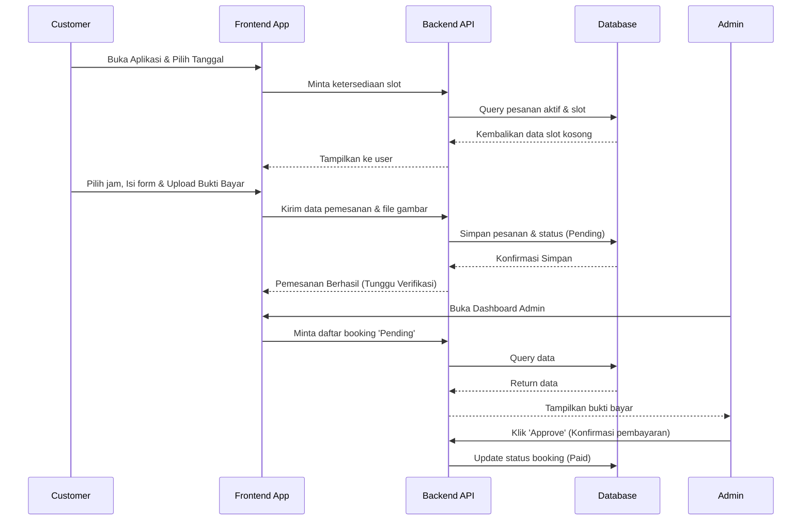
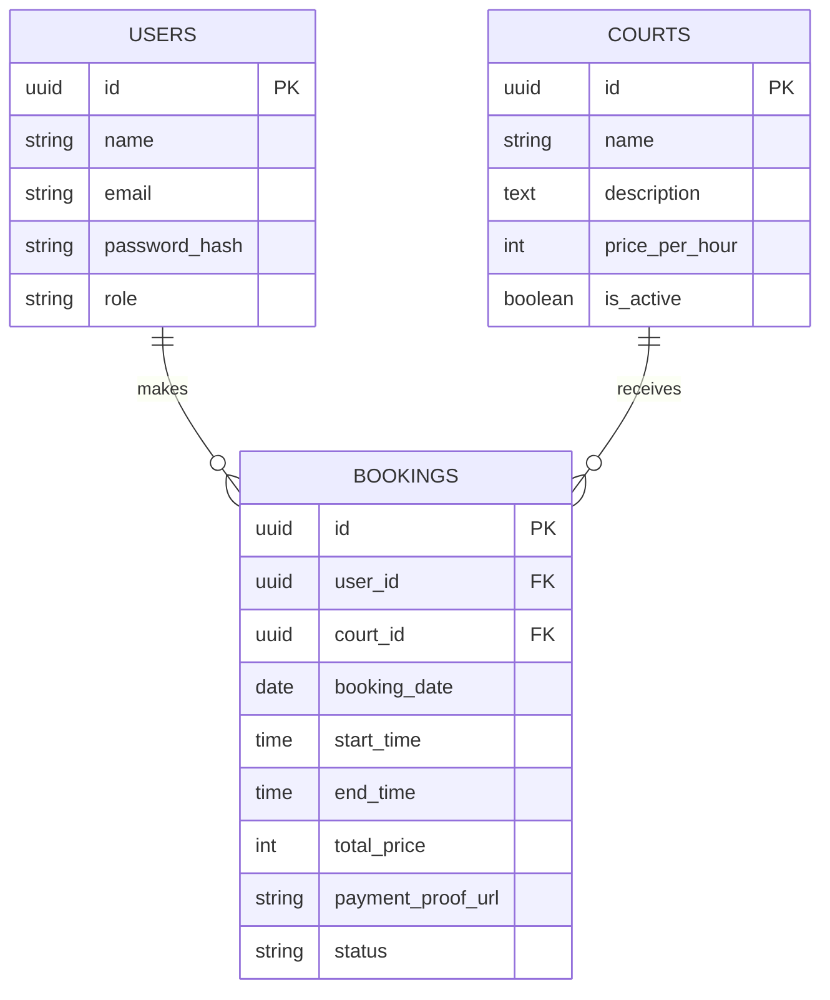

# PRD — Project Requirements Document

## 1. Overview
Aplikasi ini adalah platform pemesanan (booking) lapangan Padel yang dirancang untuk mengatasi proses pemesanan manual berbasis WhatsApp. Saat ini, pelanggan kesulitan melihat ketersediaan lapangan secara *real-time*, dan admin kewalahan dalam melakukan pengecekan ketersediaan jadwal serta konfirmasi pembayaran secara manual. Aplikasi ini akan menghemat waktu kedua belah pihak dengan fitur utama pengecekan jadwal kosong dengan mudah, pemesanan yang cepat, serta sistem verifikasi dan manajemen jadwal terpusat untuk admin.

## 2. Requirements
*   **Akses Real-time:** Pelanggan dapat melihat ketersediaan slot lapangan Padel secara *real-time* tanpa harus bertanya kepada admin.
*   **Dual-Role System:** Memiliki dua peran pengguna utama, yaitu **Customer** (untuk memesan & bayar) dan **Admin** (untuk kelola lapangan & verifikasi).
*   **Mobile-Friendly:** Tampilan website harus responsif dan mudah digunakan melalui layar ponsel, mengingat sebagian besar pelanggan akan mengecek dari HP mereka.
*   **Efisiensi Transaksi:** Sistem harus menyederhanakan alur bayar dengan fitur unggah bukti transfer.
*   **Riwayat Transparansi:** Pelanggan dan Admin memiliki akses ke riwayat dan status pesanan kapan saja.

## 3. Core Features
Sesuai dengan peta jalan (roadmap) proyek, berikut adalah fitur-fitur yang akan dikembangkan secara bertahap:

### Fase 1: Jelajah Slot [High]
Pengguna dapat melihat daftar lapangan padel beserta jadwal ketersediaan slot waktu secara real-time.
*   **Daftar Lapangan:** Menampilkan semua lapangan padel yang tersedia dengan informasi singkat.
*   **Kalender Slot:** Memilih tanggal dan melihat slot waktu yang kosong untuk setiap lapangan.
*   **Detail Lapangan:** Menampilkan informasi lengkap lapangan seperti fasilitas, harga per jam, dan lokasi.

### Fase 2: Pesan & Bayar [High]
Pengguna dapat memilih slot, mengisi data pemesanan, dan melakukan pembayaran untuk mengamankan booking.
*   **Pilih Slot:** Memilih lapangan dan slot waktu yang diinginkan dari kalender ketersediaan.
*   **Form Pemesanan:** Mengisi detail pemesan seperti nama, kontak, dan catatan khusus.
*   **Upload Bukti Bayar:** Mengunggah bukti transfer atau tangkapan layar pembayaran.
*   **Konfirmasi Booking:** Menampilkan status pemesanan setelah pembayaran diunggah dan menunggu verifikasi admin.

### Fase 3: Riwayat Booking [Medium]
Pengguna dapat melihat daftar pemesanan yang pernah dilakukan beserta statusnya.
*   **Daftar Riwayat:** Menampilkan semua booking sebelumnya, baik yang sudah selesai maupun yang masih tertunda.
*   **Detail Booking:** Melihat rincian pemesanan tertentu termasuk tanggal, lapangan, dan status pembayaran.
*   **Batalkan Pesanan:** Opsi untuk membatalkan booking yang masih bisa dibatalkan sesuai kebijakan.

### Fase 4: Masuk & Daftar [High]
Pengguna dapat membuat akun atau masuk ke akun yang sudah ada untuk mengakses fitur pribadi dan menyimpan data.
*   **Daftar Akun:** Mendaftar sebagai pengguna baru dengan email atau nomor telepon.
*   **Login:** Masuk ke aplikasi menggunakan akun yang sudah terdaftar.
*   **Lupa Kata Sandi:** Mereset kata sandi jika pengguna lupa.

### Fase 5: Dashboard Admin [High]
Admin dapat mengelola slot lapangan, melihat semua pesanan, dan mengkonfirmasi pembayaran.
*   **Kelola Slot:** Mengatur jadwal buka-tutup lapangan dan slot waktu yang tersedia.
*   **Verifikasi Pembayaran:** Melihat bukti bayar yang diunggah dan mengonfirmasi atau menolak pembayaran.
*   **Semua Pesanan:** Melihat daftar seluruh booking dari semua pengguna.
*   **Laporan Singkat:** Melihat ringkasan pemesanan harian/mingguan.

## 4. User Flow
**Alur Pelanggan (Customer):**
1.  Buka aplikasi dan telusuri **Daftar Lapangan**.
2.  Pilih **Detail Lapangan** untuk melihat harga dan fasilitas, lalu buka **Kalender Slot** untuk mencari jadwal kosong.
3.  Login/Daftar (jika belum masuk).
4.  Pilih jadwal, isi **Form Pemesanan**.
5.  Selesaikan pembayaran di luar sistem (transfer bank/e-wallet), lalu lakukan **Upload Bukti Bayar**.
6.  Menunggu status diperbarui oleh admin dan mengeceknya di menu **Riwayat Booking**.

**Alur Admin:**
1.  Login menggunakan akun Admin.
2.  Masuk ke **Dashboard Admin** > **Verifikasi Pembayaran**.
3.  Periksa buki transfer dari pesanan yang masuk; jika valid, ubah status menjadi *Approved*.
4.  Masuk ke menu **Kelola Slot** jika ingin menutup lapangan untuk pemeliharaan terjadwal.

## 5. Architecture
Aplikasi ini dirancang sebagai aplikasi web *Single-Page Application (SPA)* mandiri menggunakan *Server-Side Rendering (SSR)* untuk performa dan SEO yang maksimal. Aplikasi klien berinteraksi dengan API terintegrasi yang berkomunikasi ke layanan *database* untuk menyimpan semua data lapangan, data pelanggan, dan sesi.

## 6. Database Schema
Berikut adalah tabel utama yang dibutuhkan oleh aplikasi beserta kolom-kolomnya:

*   **Users** (Menyimpan data pendaftaran dan autentikasi, baik Customer maupun Admin)
    *   `id` (String/UUID): Primary Key.
    *   `name` (String): Nama lengkap pengguna.
    *   `email` (String): Email untuk login.
    *   `password_hash` (String): Kata sandi terenkripsi.
    *   `role` (String): Menentukan hak akses (`customer` atau `admin`).
*   **Courts** (Menyimpan informasi master lapangan Padel)
    *   `id` (String/UUID): Primary Key.
    *   `name` (String): Nama lapangan (misal: "Lapangan A - Indoor").
    *   `description` (Text): Fasilitas dan keterangan lainnya.
    *   `price_per_hour` (Integer): Harga sewa per jam.
    *   `is_active` (Boolean): Status aktif/tidak lapangan.
*   **Bookings** (Menyimpan data pesanan, waktu, dan status pembayaran)
    *   `id` (String/UUID): Primary Key.
    *   `user_id` (String): Foreign Key ke tabel Users.
    *   `court_id` (String): Foreign Key ke tabel Courts.
    *   `booking_date` (Date): Tanggal pesanan lapangan.
    *   `start_time` (Time): Waktu mulai main.
    *   `end_time` (Time): Waktu selesai main.
    *   `total_price` (Integer): Total tagihan pemesanan.
    *   `payment_proof_url` (String): Link/URL gambar bukti bayar.
    *   `status` (String): Status (`pending`, `confirmed`, `cancelled`).

## 7. Tech Stack
Berikut direkomendasikan teknologi modern, responsif, dan ringan yang akan digunakan untuk eksekusi aplikasi ini (mengacu pada standar Full-stack *default* terbaik dan tercepat):
*   **Frontend & Web Framework:** Next.js (App Router) dengan React.js.
*   **Styling:** Tailwind CSS dipadukan dengan komponen siap pakai dari shadcn/ui.
*   **Backend & API:** Next.js API Routes / Server Actions.
*   **Database ORM:** Drizzle ORM.
*   **Database Engine:** SQLite (ringan dan mudah dideploy, sangat cocok untuk booking app skala kecil ke menengah).
*   **Authentication:** Better Auth (untuk alur daftar, login, reset password yang aman).